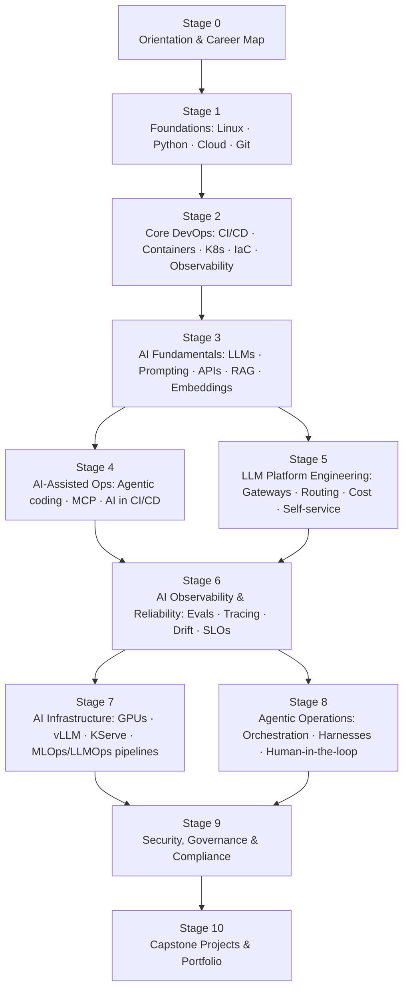

<div align="center">

# 🛰️ AIOps Zero to Hero

### The open curriculum for AI in DevOps, SRE, Cloud & Platform Engineering

**From your first `kubectl get pods` to running the AI platform of an entire engineering org.**

[](LICENSE)
[](CONTRIBUTING.md)
[](#-the-roadmap)
[](#-how-resources-are-curated)

</div>

---

## 🎯 Why this exists

A new career track has emerged at the intersection of DevOps, cloud, and AI. Companies are hiring for it under many names — **AI Operations Lead, AI Platform Engineer, Senior AI Reliability Engineer, AI Infrastructure Engineer, LLMOps / AIOps Engineer** — but the job is fundamentally the same:

> **Operate AI systems in production, and use AI to operate production systems — safely, reliably, and at scale.**

Great learning resources exist for AI engineering (building models and apps) and for classic DevOps. Almost nothing teaches the space *between* them: LLM gateways, evaluation pipelines, agentic SDLC governance, GPU infrastructure, AI observability, token cost management, and guardrails. This curriculum fills that gap.

Everything here is built from **real job descriptions** (see [career/job-profiles.md](career/job-profiles.md) for decoded examples) so you learn exactly what employers ask for.

## 🧭 Who this is for

| You are… | Start at |
|---|---|
| New to tech, aiming at this career | [Stage 0 → 1](stages/00-orientation/) |
| A developer with no ops background | [Stage 1 → 2](stages/01-foundations/) |
| A DevOps / Cloud / SRE engineer adding AI | [Stage 3](stages/03-ai-fundamentals/) |
| An ML / data engineer moving toward platform work | [Stage 2](stages/02-core-devops/), then jump to [Stage 5](stages/05-llm-platform-engineering/) |
| Already running LLMs in prod, going senior | [Stages 6–9](stages/06-ai-observability-reliability/) |

## 🗺️ The Roadmap



| # | Stage | You'll be able to… | Level |
|---|---|---|---|
| 0 | [Orientation & Career Map](stages/00-orientation/) | Explain the role landscape and plan your path | 🟢 Beginner |
| 1 | [Foundations](stages/01-foundations/) | Use Linux, Python, Git and one cloud confidently | 🟢 Beginner |
| 2 | [Core DevOps](stages/02-core-devops/) | Ship with CI/CD, Docker, Kubernetes, Terraform, Prometheus/Grafana | 🟢→🟡 |
| 3 | [AI Fundamentals](stages/03-ai-fundamentals/) | Work with LLM APIs, prompting, embeddings, RAG, basic evals | 🟡 Intermediate |
| 4 | [AI-Assisted Ops](stages/04-ai-assisted-ops/) | Use agentic coding tools, MCP, and AI inside pipelines & runbooks | 🟡 Intermediate |
| 5 | [LLM Platform Engineering](stages/05-llm-platform-engineering/) | Run an LLM gateway with routing, rate limits, cost controls, self-service | 🟡→🔴 |
| 6 | [AI Observability & Reliability](stages/06-ai-observability-reliability/) | Build eval pipelines, tracing, drift detection, SLOs and incident response for AI | 🔴 Advanced |
| 7 | [AI Infrastructure](stages/07-ai-infrastructure/) | Serve models on Kubernetes with GPUs: vLLM, KServe, Kueue, autoscaling | 🔴 Advanced |
| 8 | [Agentic Operations](stages/08-agentic-operations/) | Govern multi-agent systems: harnesses, quality gates, human oversight | 🔴 Advanced |
| 9 | [Security, Governance & Compliance](stages/09-security-governance/) | Apply OWASP LLM Top 10, guardrails, PII controls, NIST AI RMF, EU AI Act | 🔴 Advanced |
| 10 | [Capstones & Portfolio](stages/10-capstones/) | Prove it all with end-to-end projects employers recognize | 🔴 Expert |

**Estimated effort:** ~9–15 months from zero at 8–10 hrs/week; ~4–6 months for experienced DevOps/cloud engineers starting at Stage 3.

## 🚀 Getting started — three ways to learn

### 1. In your terminal, with your AI agent (recommended) 📦

The curriculum ships as [Agent Skills](skills/) — works with Claude Code, Cursor, Codex, and any SKILL.md-compatible agent. No clone required:

```bash
npx skills add nomadicmehul/aiopszerotohero
```

Then in your agent:

| Command | What it does |
|---|---|
| `/aiops-start` | Placement quiz → your personal study plan (`LEARNING.md`) |
| `/aiops-learn` | One interactive lesson or lab session at a time, progress tracked |
| `/aiops-quiz` | Spaced-repetition checks — honest grades, review queue |
| `/aiops-lab-review` | Senior-engineer review of your lab work, pass/not-yet verdicts |
| `/aiops-guide` | "Where do I learn X?" — instant pointer into the right stage |

See [skills/README.md](skills/README.md) for details.

### 2. Browse the website locally

```bash
git clone https://github.com/nomadicmehul/aiopszerotohero.git && cd aiopszerotohero
python3 -m http.server 4173
# open http://localhost:4173/site/
```

### 3. Read it right here

Every stage is plain markdown in [stages/](stages/) — start at [Stage 0](stages/00-orientation/).

## 📚 How each stage works

Every stage follows the same pattern:

1. **Why it matters** — mapped to lines from real job postings
2. **Core topics** — the concepts to master, in order
3. **Curated resources** — free-first: docs, courses, books, talks
4. **Hands-on labs** — you learn ops by *operating*, not reading
5. **Skills checklist** — "you're ready for the next stage when…"

## 🧪 How resources are curated

- **Free-first.** Paid resources only when clearly superior, always marked 💰.
- **Primary sources preferred.** Official docs and project repos over blog rehashes.
- **Battle-tested.** Someone in the community used it and vouched for it.
- **Fresh.** The AI stack moves fast — resources are reviewed for currency; stale ones are pruned.

## 🤝 Contribute (this is a community project)

This hub is designed to be built together. There's a full **contributor track** — from suggesting one link to becoming a stage maintainer:

- 🐣 **Learner** → open an issue with a resource that helped you
- 🛠️ **Contributor** → PR a resource, lab, or fix (see [CONTRIBUTING.md](CONTRIBUTING.md))
- 🔍 **Reviewer** → help vet links and keep stages current
- 🧭 **Maintainer** → own a stage and its roadmap

Start with [CONTRIBUTING.md](CONTRIBUTING.md). First-timers welcome — `good first issue` labels are waiting.

## 🧰 Companion material

- [career/job-profiles.md](career/job-profiles.md) — real job descriptions, decoded line-by-line into skills
- [career/certifications.md](career/certifications.md) — which certs matter (and which don't)
- [career/interview-prep.md](career/interview-prep.md) — interview themes and system-design questions for this track
- [community/learning-log-template.md](community/learning-log-template.md) — track your progress in public

## 🙏 Inspiration & sibling projects

- [ai-engineering-from-scratch](https://github.com/rohitg00/ai-engineering-from-scratch) — the AI *engineering* path (build models & apps); we cover the AI *operations* path
- [roadmap.sh/devops](https://roadmap.sh/devops) & [roadmap.sh/mlops](https://roadmap.sh/mlops) — visual role roadmaps
- [tensorchord/Awesome-LLMOps](https://github.com/tensorchord/Awesome-LLMOps), [visenger/awesome-mlops](https://github.com/visenger/awesome-mlops), [OpsPAI/awesome-AIOps](https://github.com/OpsPAI/awesome-AIOps) — tool & paper lists (we add the *learning path* on top)

## 📜 License

[MIT](LICENSE) — learn, fork, remix, teach.

---

<div align="center">

**⭐ Star the repo if it helps you — it helps others find it.**

*Built by practitioners, for the next generation of AI-native operators.*

</div>
